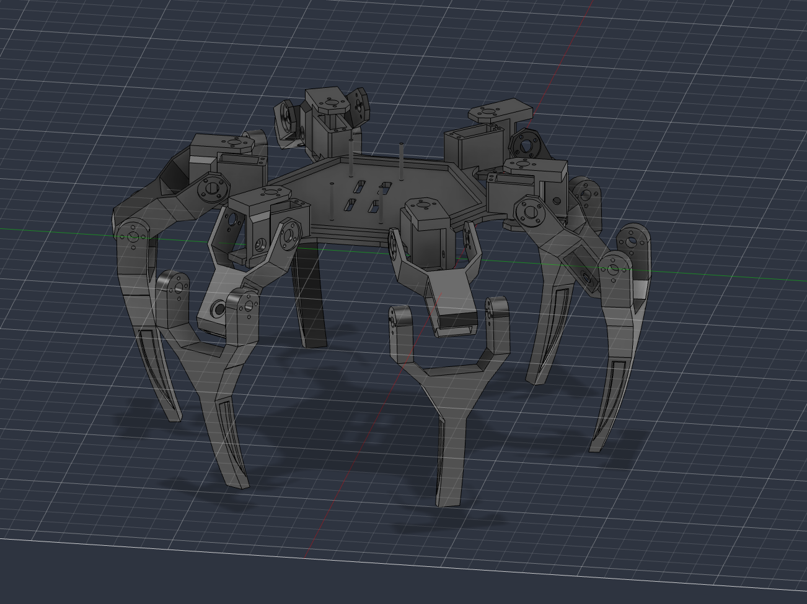
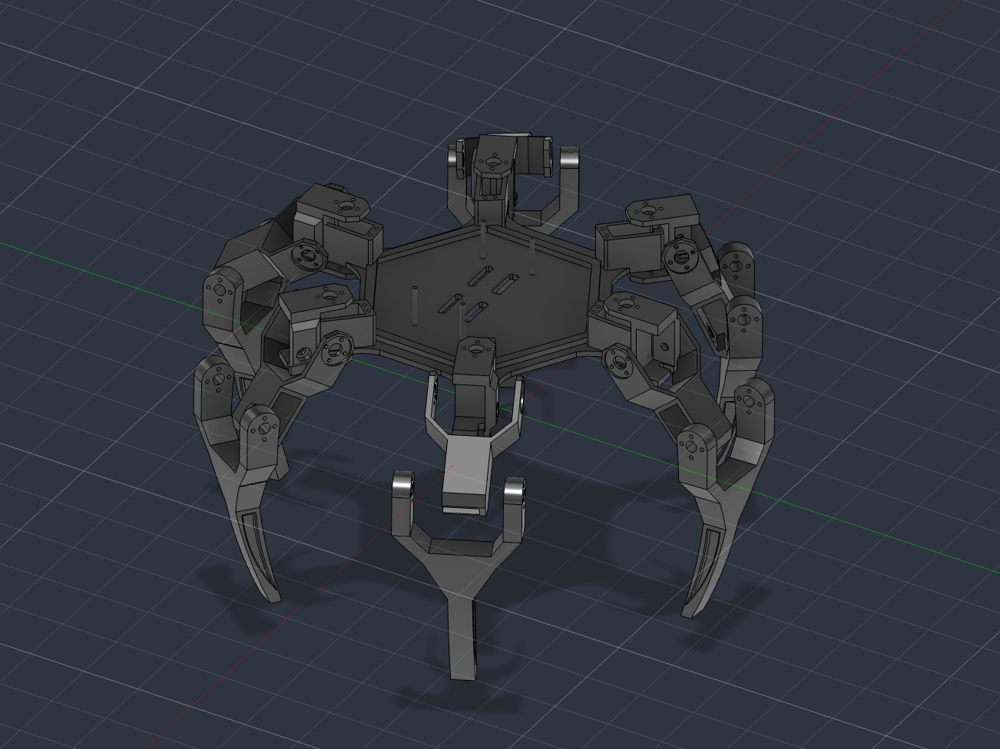
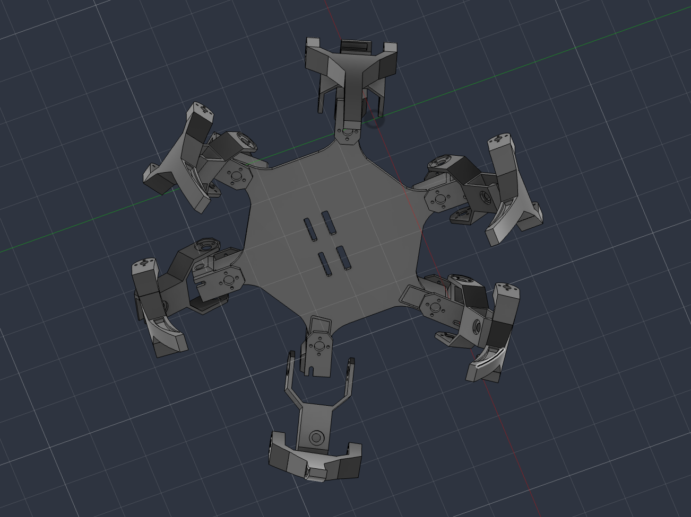

# Hexapod Walking Robot

This project features a **6-legged (hexapod) walking robot** controlled by an **Arduino Mega**. Each leg has **3 degrees of freedom**, using a total of **18 servo motors** to provide precise and balanced movement. The robot uses a **tripod gait algorithm** for stable walking and connects wirelessly using an **ExpressLRS (ELRS) receiver**.

it features:

- 3 degrees of freedom per leg
- **Coxa, femur, and tibia** joints on each leg
- Tripod gait algorithm for stable walking
- ExpressLRS (ELRS) wireless control

## design

The robot is designed around a six-legged configuration with three servo-controlled joints on each leg. The three joints are the **coxa, femur, and tibia**, providing independent control over the position and movement of each leg.

The mechanical structure is arranged symmetrically around the center of the robot to maintain balance and provide predictable movement.

The **Arduino Mega** handles the servo control and gait calculations, while the **ELRS receiver** provides wireless commands to the robot.

## CAD

Final 3D views of the hexapod robot.

| Top view                           | Bottom view                              |
| ---------------------------------- | ---------------------------------------- |
|  |  |

| Side view                            |
| ------------------------------------ |
|  |

The mechanical structure was designed to accommodate the six legs, servo motors, electronics, and required mounting points while maintaining a balanced layout.

## Movement

Each leg has **3 degrees of freedom**:

- **Coxa** controls the horizontal rotation and positioning of the leg
- **Femur** controls the main lifting movement of the leg
- **Tibia** controls the lower leg extension and foot position

With six independently controlled legs, the robot uses **18 servo motors** in total.

The robot uses a **tripod gait algorithm** to achieve stable walking. The six legs are divided into two groups of three. One tripod remains on the ground to support the robot while the other tripod moves, after which the groups alternate.

This coordinated movement allows the robot to maintain stability while moving forward and can also be adapted for other walking directions.

## BOM

the complete bill of materials is available in [`bom.csv`](bom.csv).
