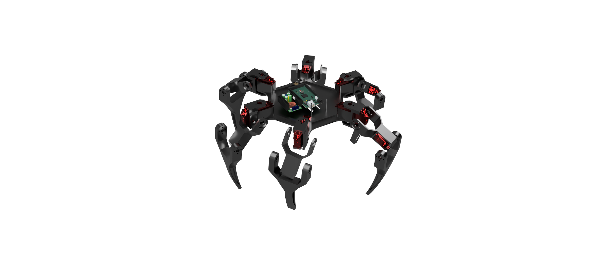
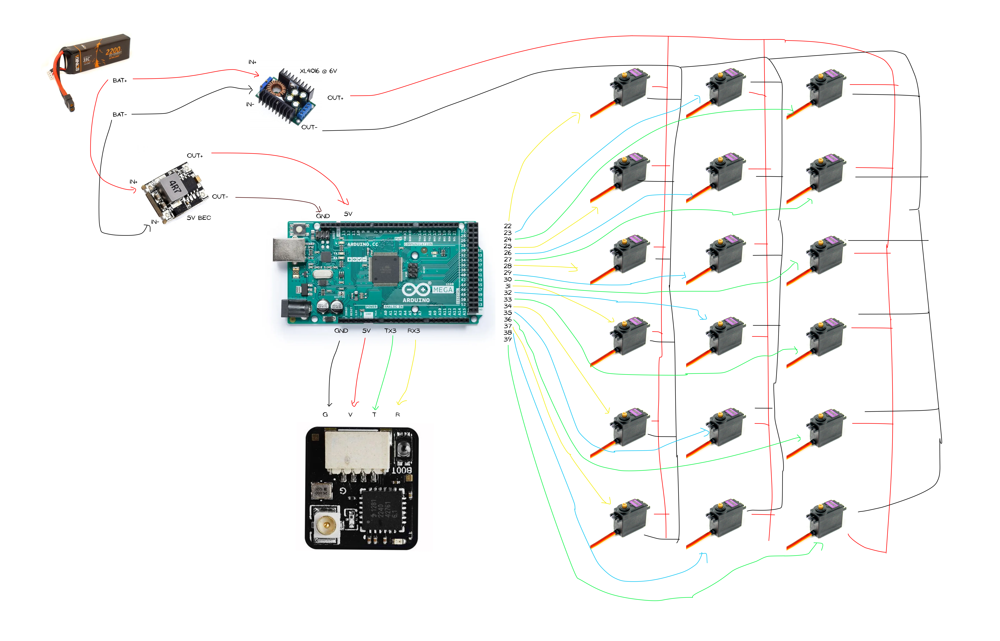

<h1 align="center">
  arachne
   
</h1>

<h4 align="center">
    18 dof hexapod
</h4>

## it features:

- 3 degrees of freedom per leg
- coxa, femur, and tibia joints on each leg
- tripod gait for stable walking
- elrs for wireless control

## design

the robot uses a six-legged design, with three servo-controlled joints on each leg: coxa, femur, and tibia. this lets each leg move independently and gives the robot better control while walking.

the legs are arranged evenly around the center to keep the robot balanced and make its movements more predictable.

the arduino mega controls the servos and handles the gait calculations, while the elrs receiver sends wireless commands to the robot.

### wiring

## CAD

| Top view                           | Bottom view                              |
| ---------------------------------- | ---------------------------------------- |
|  |  |

| Side view                            |
| ------------------------------------ |
|  |

## BOM

the complete bill of materials is available in [`bom.csv`](bom.csv).
